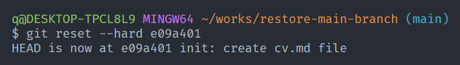
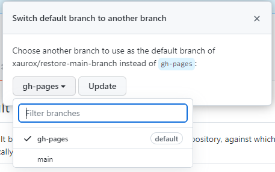

# Гайд по восстановлению ветки main

## Создание ветки

0. Если в процессе выполнения какого-то таска Вы не делали коммитов в ветку `main`, то при необходимости открыть Pull Request в ветку main Вас будет ожидать сюрприз - такой ветки на GitHub'е не окажется.

Что же делать?

1. Создаём ветку `main`

От текущей ветки (пусть это будет ветка `gh-pages`) создаём ветку `main`:

И переходим на неё:

2. Сброс истории коммитов

Теперь удалим всю историю разработки из ветки main. Для этого сначала найдём первый коммит.

Можно воспользоваться командой `git log --oneline`:

Или расширением `Git Graph`:

Нам нужно найти хэш самого первого коммита (в данном случае это будет `e09a401`).

Теперь воспользуемся "жестким" сбросом (Вместо `e09a401` нужно подставить хэш своего первого коммита):

3. Отправка ветки в GitHub

Теперь необходимо отправить нашу ветку main, содержащую только первый коммит, в GitHub. Для этого выполняем команду `git push`:

Вуаля, наша ветка теперь на GitHub'е:

## Установка ветки main веткой по умолчанию

Как видно на последнем изображении, ветка `main` появилась на GitHub'е, но пометка `default` по-прежнему стоит напротив ветки `gh-pages`. Исправим это.

В списке веток нажимаем на ссылку `View all branches` и переходим на эту страницу, где нажимаем на иконку в виде двух стрелок:

На следующей странице вновь нажимаем иконку в виде двух стрелок:

В открывшемся меню выбираем ветку `main` и затем нажимаем кнопку `Update`:

Отлично, теперь у нас есть ветка `main` и она имеет пометку `default`:

## Создание Pull Request

После выполнения всех указанных выше действий можно переходить к созданию Pull Request из ветки `gh-pages` в `main`. Удачи!
